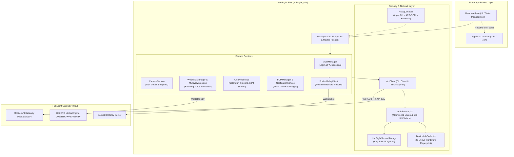

# HubSight Mobile SDK for Flutter

[](https://pub.dev/packages/hubsight_sdk)
[](https://pub.dev/packages/hubsight_sdk/score)
[](https://flutter.dev)
[](https://dart.dev)
[](https://flutter.dev)
[](test)
[-success>)](analysis_options.yaml)
[](LICENSE)

An enterprise-grade, production-ready Flutter Client SDK tailored for the **HubSight** CCTV video surveillance and NVR playback platform. The SDK encapsulates secure communication with the **Mobile Gateway (`/api/app/v1/*`)** on port `:8088`, ultra-low latency WebRTC video streaming (via Go2RTC), real-time event synchronization via Socket.IO, and Zero-Config `.hscfg` encrypted container enrollment.

---

## 📑 Table of Contents

1. [Architecture & Design Principles](#1-architecture--design-principles)
2. [Key Features](#2-key-features)
3. [Platform Prerequisites & Permissions](#3-platform-prerequisites--permissions)
4. [Installation](#4-installation)
5. [Quick Start & Usage Guide](#5-quick-start--usage-guide)
    - [5.1 Zero-Config Enrollment (.hscfg Container)](#51-zero-config-enrollment-hscfg-container)
    - [5.2 Direct Initialization from Config](#52-direct-initialization-from-config)
    - [5.3 Authentication & TOTP 2FA](#53-authentication--totp-2fa)
    - [5.4 Atomic Token Refresh (401 Mutex Queue)](#54-atomic-token-refresh-401-mutex-queue)
    - [5.5 Live Video Surveillance](#55-live-video-surveillance)
    - [5.6 NVR Archive & Timeline Playback](#56-nvr-archive--timeline-playback)
    - [5.7 Push Notifications (FCM) & App Badge](#57-push-notifications-fcm--app-badge)
    - [5.8 Real-Time Remote Session Revocation](#58-real-time-remote-session-revocation)
    - [5.9 App Lifecycle Management](#59-app-lifecycle-management)
6. [Standardized Error Architecture](#6-standardized-error-architecture)
7. [Repository Structure](#7-repository-structure)
8. [Technical Documentation Sitemap](#8-technical-documentation-sitemap)
9. [Testing & Verification](#9-testing--verification)
10. [Security & Compliance](#10-security--compliance)
11. [License](#11-license)

---

## 1. Architecture & Design Principles

The SDK adheres to modern mobile client architecture standards:

- **Clean Architecture & Separation of Concerns**: Independent domain services (`Auth`, `Media`, `Archive`, `Notifications`, `Realtime`).
- **Zero Hardcoded UI Text**: The SDK core **strictly avoids hardcoding UI messages** in any language (English, Vietnamese, etc.). Every exception exposes a machine-readable `HubSightErrorCode` enum so consuming applications can localize strings according to their own internationalization (i18n/l10n) setup.
- **Security-First**: In-memory ephemeral container decryption (zero persistent disk leaks of decrypted credentials), encrypted storage in hardware Keystore/Keychain, and device integrity verification via SHA-256 hardware fingerprinting.
- **Resource & Battery Conscious**: Automatic release of WebRTC streams when entering background state, unified 30s heartbeat polling, and bandwidth-optimized snapshot thumbnails.



---

## 2. Key Features

| Feature                                  | Description                                                                                                                                                                                                                                          |
| :--------------------------------------- | :--------------------------------------------------------------------------------------------------------------------------------------------------------------------------------------------------------------------------------------------------- |
| 🛡️ **Zero-Config Enrollment (`.hscfg`)** | Secure setup via a 6-digit PIN: key derivation via **Argon2id** (64MB RAM, 4 rounds, parallelism 4), **AES-256-GCM** decryption, **Ed25519** signature verification, and in-memory ZIP decompression without touching disk storage.                  |
| 🔄 **Atomic Token Refresh (401 Mutex)**  | Completely resolves race conditions when concurrent background requests fail with `401 Unauthorized`. Uses a `Completer` mutex queue: only 1 request performs token refresh; all pending requests queue up and seamlessly replay with the new token. |
| 🛑 **Emergency Kill-Switch (HTTP 503)**  | Automatically detects `APP_API_DISABLED` and `Retry-After` headers when the administrator puts the mobile service under maintenance, triggering an `onMaintenance` callback.                                                                         |
| 🖼️ **Real-Time Snapshots (640p 15FPS)**  | `HubSightCameraThumbnail` widget uses Query Authentication (`?token=...&apiKey=...`) and `gaplessPlayback: true` to display fluid camera grid views without saturating WebRTC connection pools or draining device batteries.                         |
| 🔲 **Multi-View Batching**               | Negotiates multiple WebRTC video streams in a single HTTP request (`batch-webrtc`), bundles keep-alive heartbeats into one 30s cycle (`batch-heartbeat`), and releases all streams simultaneously (`batch-release`).                                 |
| ⚡ **Real-Time Remote Revocation**       | Connects to Socket.IO Relay to listen for `session:revoked`. If an administrator or user revokes a session remotely, the device immediately deletes credentials, tears down WebRTC streams, and kicks back to login.                                 |
| 🔋 **App Lifecycle Management**          | `AppLifecycleManager` pauses WebRTC streams and heartbeat timers when the app moves to background, instantly restoring active streams when resuming foreground.                                                                                      |
| 🔔 **FCM Notifications & App Badge**     | Automatically registers FCM push tokens on login, unregisters on logout, and provides an ultra-lightweight `getUnreadCount()` API to synchronize launcher badges.                                                                                    |

---

## 3. Platform Prerequisites & Permissions

### Compatibility:

- **Flutter SDK**: `>= 3.10.0` (Recommended `>= 3.16.0`)
- **Dart SDK**: `>= 3.0.0 < 4.0.0`

### iOS Configuration (`ios/Runner/Info.plist`)

Add media and network descriptions if using WebRTC two-way audio or private IP development:

```xml
<!-- Camera & Microphone permissions (for QR scanning and WebRTC two-way talk) -->
<key>NSCameraUsageDescription</key>
<string>This app requires camera access to scan configuration QR codes and enable video features.</string>
<key>NSMicrophoneUsageDescription</key>
<string>This app requires microphone access for two-way audio communication through cameras.</string>

<!-- Allow local IP / Development gateway connections -->
<key>NSAppTransportSecurity</key>
<dict>
    <key>NSAllowsArbitraryLoads</key>
    <true/>
</dict>
```

### Android Configuration (`android/app/src/main/AndroidManifest.xml`)

Ensure required network and audio permissions are declared:

```xml
<uses-permission android:name="android.permission.INTERNET" />
<uses-permission android:name="android.permission.ACCESS_NETWORK_STATE" />
<uses-permission android:name="android.permission.CAMERA" />
<uses-permission android:name="android.permission.RECORD_AUDIO" />
<uses-permission android:name="android.permission.MODIFY_AUDIO_SETTINGS" />
```

---

## 4. Installation

### From [pub.dev](https://pub.dev/packages/hubsight_sdk) (Recommended)

Add `hubsight_sdk` to your Flutter project via terminal:

```bash
flutter pub add hubsight_sdk
```

Or manually declare it in your `pubspec.yaml`:

```yaml
dependencies:
    flutter:
        sdk: flutter
    hubsight_sdk: ^1.2.0
```

### Alternative Sources

From GitHub:

```yaml
dependencies:
    hubsight_sdk:
        git:
            url: https://github.com/HubSight/flutter-sdk.git
            ref: v1.2.0
```

Or locally in a monorepo workspace:

```yaml
dependencies:
    hubsight_sdk:
        path: ../flutter-sdk
```

Then fetch the packages:

```bash
flutter pub get
```

---

## 5. Quick Start & Usage Guide

### 5.1 Zero-Config Enrollment (.hscfg Container)

Download the `.hscfg` container bytes from the QR code presigned URL or Admin Portal:

```dart
import 'dart:typed_data';
import 'package:hubsight_sdk/hubsight_sdk.dart';

// 1. Load container bytes and 6-digit PIN provided by admin
final Uint8List hscfgBytes = await loadConfigFileBytes();
final String pin6Digits = '123456';

// 2. Initialize SDK (Argon2id -> AES-256-GCM -> Ed25519 -> In-Memory Unzip)
final sdk = await HubSightSDK.fromHscfg(
  fileBytes: hscfgBytes,
  pin6Digits: pin6Digits,
  onMaintenance: (maintenance) {
    debugPrint('System under maintenance! Retry after ${maintenance.retryAfterSeconds}s');
  },
  onSessionExpired: () {
    debugPrint('Session expired. Redirecting user to login screen.');
  },
);
```

### 5.2 Direct Initialization from Config

For internal staging or automated test environments:

```dart
final config = AppConfig(
  apiKey: 'hsc_live_app_xxxxxxxxxxxxxxxxxxxx',
  urls: AppUrls(
    gatewayUrl: 'https://cctv.hubsight.internal:8088',
    webrtcUrl: 'https://cctv.hubsight.internal:8088/api/app/v1/cameras/live/webrtc',
    snapshotUrl: 'https://cctv.hubsight.internal:8088/api/app/v1/cameras/live/snapshot',
    socketRelayUrl: 'https://cctv.hubsight.internal:8088',
  ),
  settings: AppSettings(
    enablePushNotifications: true,
    multiViewHeartbeatIntervalSeconds: 30,
    thumbnailRefreshIntervalSeconds: 4,
  ),
);

final sdk = HubSightSDK(config: config);
await sdk.initialize();
```

---

### 5.3 Authentication & TOTP 2FA

Supports the full Mobile API v1 authentication lifecycle:

```dart
// Step 1: Submit credentials (Hardware fingerprint & optional GPS coordinates attached)
final loginResult = await sdk.auth.login(
  username: 'operator_01',
  password: 'Password@1234',
  latitude: 10.7769, // Optional GPS latitude
  longitude: 106.7009, // Optional GPS longitude
  geoCity: 'Ho Chi Minh City', // Optional resolved city
);

if (loginResult.requires2FA) {
  // 2FA challenge required:
  final preAuthToken = loginResult.preAuthToken!;

  // Prompt user for 6-digit TOTP code:
  final verifyResult = await sdk.auth.verify2FA(
    preAuthToken: preAuthToken,
    code: '492810',
  );

  debugPrint('2FA Login succeeded: ${verifyResult.user?.fullName}');
} else if (loginResult.isSuccess) {
  debugPrint('Login succeeded: ${loginResult.user?.fullName}');
}
```

---

### 5.4 Atomic Token Refresh (401 Mutex Queue)

The SDK includes a built-in **Atomic Mutex Token Refresh** mechanism in [`AuthInterceptor`](lib/src/network/auth_interceptor.dart):

- When the Access Token expires, concurrent requests receiving `401 Unauthorized` are intercepted.
- `AuthInterceptor` holds pending requests in an asynchronous queue and executes **exactly one** `/api/app/v1/auth/refresh` call.
- Upon successful refresh, the new token is saved to secure storage, and **all queued requests are automatically updated and replayed**.
- If the Refresh Token itself is expired or revoked, the SDK triggers the `onSessionExpired` callback for safe UI navigation.

---

### 5.5 Live Video Surveillance

#### A. Snapshot Thumbnails (Battery & Bandwidth Optimized)

Ideal for camera list screens without opening heavy WebRTC streams:

```dart
HubSightCameraThumbnail(
  gatewayUrl: sdk.config.urls.gatewayUrl,
  thumbnailUrl: camera.thumbnailUrl,
  apiKey: sdk.config.apiKey,
  token: await sdk.storage.getAccessToken() ?? '',
  isStopped: camera.isStopped,
  refreshInterval: const Duration(seconds: 4),
  fit: BoxFit.cover,
)
```

#### B. Single-Camera WebRTC Stream

Used when viewing a single camera in full resolution:

```dart
final rtcManager = sdk.createWebRTCManager(camera.id);

HubSightWebRTCView(
  manager: rtcManager,
  autoStart: true,
  objectFit: RTCVideoViewObjectFit.RTCVideoViewObjectFitCover,
  placeholder: const Center(child: CircularProgressIndicator()),
)
```

#### C. Multi-View Camera Grid (Batching & 30s Heartbeat)

Batches WebRTC negotiations into 1 request and maintains a single 30s heartbeat timer:

```dart
final multiViewSession = sdk.createMultiViewSession();

HubSightMultiViewGrid(
  session: multiViewSession,
  cameraIds: ['cam_01', 'cam_02', 'cam_03', 'cam_04'],
  crossAxisCount: 2,
)

// When leaving the screen, all streams are released in a single batch request:
// multiViewSession.dispose() -> calls batch-release on Gateway
```

---

### 5.6 NVR Archive & Timeline Playback

Query recorded video history by calendar days and timestamps:

```dart
// 1. Check days with available recordings in a month
final calendar = await sdk.archive.getCalendar(
  cameraId: 'cam_front_door',
  year: 2026,
  month: 9,
);
debugPrint('Recording days: ${calendar.daysWithRecordings}');

// 2. Query recorded segments for a specific time range
final segments = await sdk.archive.getTimeline(
  cameraId: 'cam_front_door',
  from: DateTime.parse('2026-09-09T08:00:00Z'),
  to: DateTime.parse('2026-09-09T18:00:00Z'),
);

// 3. Obtain presigned MP4 stream URL
if (segments.isNotEmpty) {
  final playStream = await sdk.archive.getPlayStream(segments.first.id);
  debugPrint('MP4 Stream URL: ${playStream.streamUrl}');
}
```

---

### 5.7 Push Notifications (FCM) & App Badge

```dart
// Register FCM device token after successful login:
final fcmToken = await FirebaseMessaging.instance.getToken();
if (fcmToken != null) {
  await sdk.fcm.registerPushToken(fcmToken);
}

// Fetch unread count for the app launcher badge:
final unreadCount = await sdk.notifications.getUnreadCount();
FlutterAppBadger.updateBadgeCount(unreadCount);

// Delete multiple notifications in a single API request:
final deletedCount = await sdk.notifications.deleteNotifications([
  'notification_01',
  'notification_02',
]);

// Unregister token upon logout:
await sdk.fcm.unregisterPushToken(fcmToken);
```

---

### 5.8 Real-Time Remote Session Revocation

Upon login, the SDK establishes a connection to the Socket.IO Relay server. When an administrator or user clicks **"Revoke Session"** in the Web Portal:

```dart
// The SDK automatically handles the 'session:revoked' event:
// 1. Clears tokens in Keychain/Keystore.
// 2. Disposes all WebRTC streams and background timers.
// 3. Triggers onSessionExpired to return the user to the Login screen.
```

---

### 5.9 App Lifecycle Management

The SDK integrates with `WidgetsBindingObserver` via [`AppLifecycleManager`](lib/src/lifecycle/app_lifecycle_manager.dart):

- **When entering background/paused**: Pauses active WebRTC streams and suspends heartbeat timers to conserve battery and server connections.
- **When resuming foreground**: Seamlessly resumes live camera streams.

---

## 6. Standardized Error Architecture

The SDK strictly adheres to **enterprise API/SDK architectural standards**:

1. **Zero hardcoded UI strings**: All exceptions inherit from `HubSightException` and carry a `HubSightErrorCode code`.
2. **`developerMessage` is developer-facing only**: Internal error messages are intended solely for debugging and crash logging (Crashlytics/Sentry).
3. **`HubSightErrorResolver` pattern**: Consuming apps resolve `HubSightErrorCode` into their own localized UI strings.

### Error Code Reference (`HubSightErrorCode`)

| Domain Group             | Enum Code                       | Wire Code                          | Technical Meaning                                       |
| :----------------------- | :------------------------------ | :--------------------------------- | :------------------------------------------------------ |
| **Config (`.hscfg`)**    | `configInvalidPinFormat`        | `CONFIG_INVALID_PIN_FORMAT`        | PIN is not exactly 6 numeric digits.                    |
|                          | `configCorrupted`               | `CONFIG_CORRUPTED`                 | Container file is corrupted or smaller than 50 bytes.   |
|                          | `configInvalidHeader`           | `CONFIG_INVALID_HEADER`            | Magic header does not match `HSCFG\x01`.                |
|                          | `configDecryptionFailed`        | `CONFIG_DECRYPTION_FAILED`         | Incorrect PIN or GCM Authentication Tag mismatch.       |
|                          | `configDecompressionFailed`     | `CONFIG_DECOMPRESSION_FAILED`      | In-memory ZIP decompression failed.                     |
|                          | `configMissingRequiredFiles`    | `CONFIG_MISSING_REQUIRED_FILES`    | Missing `config.yaml` or `signature.sig` in container.  |
|                          | `configMalformedYaml`           | `CONFIG_MALFORMED_YAML`            | Malformed `config.yaml` syntax.                         |
|                          | `configInvalidSignature`        | `CONFIG_INVALID_SIGNATURE`         | Ed25519 digital signature verification failed.          |
| **Network & Transport**  | `networkTimeout`                | `NETWORK_TIMEOUT`                  | Connection or read timeout exceeded.                    |
|                          | `networkUnreachable`            | `NETWORK_UNREACHABLE`              | No internet connection or DNS resolution failed.        |
|                          | `networkConnectionRefused`      | `NETWORK_CONNECTION_REFUSED`       | Server port closed or connection refused.               |
|                          | `networkCanceled`               | `NETWORK_CANCELED`                 | Request was actively cancelled by client.               |
|                          | `networkUnknown`                | `NETWORK_UNKNOWN`                  | Unknown transport layer failure.                        |
| **Auth & Session**       | `authInvalidCredentials`        | `AUTH_INVALID_CREDENTIALS`         | Invalid username or password.                           |
|                          | `authTwoFactorRequired`         | `AUTH_2FA_REQUIRED`                | 2FA TOTP code required (`pre_auth_token`).              |
|                          | `authInvalidTwoFactorCode`      | `AUTH_INVALID_2FA_CODE`            | Invalid or expired 2FA code / recovery code.            |
|                          | `authRefreshTokenExpired`       | `AUTH_REFRESH_TOKEN_EXPIRED`       | Refresh token expired; re-login required.               |
|                          | `authRefreshTokenRevoked`       | `AUTH_REFRESH_TOKEN_REVOKED`       | Refresh token was revoked.                              |
|                          | `authSessionRevoked`            | `AUTH_SESSION_REVOKED`             | Session revoked remotely by admin or another device.    |
|                          | `authSessionExpired`            | `AUTH_SESSION_EXPIRED`             | Session expired completely.                             |
|                          | `authWeakPassword`              | `AUTH_WEAK_PASSWORD`               | Password does not meet security requirements.           |
|                          | `authChangePasswordFailed`      | `AUTH_CHANGE_PASSWORD_FAILED`      | Password update failed.                                 |
|                          | `authUnauthorized`              | `AUTH_UNAUTHORIZED`                | Unauthorized request (HTTP 401).                        |
| **Security & Keys**      | `appKeyRequired`                | `APP_KEY_REQUIRED`                 | Missing `X-API-Key` HTTP header.                        |
|                          | `appKeyInvalidOrRevoked`        | `INVALID_APP_KEY`                  | API Key does not exist or has been disabled.            |
|                          | `accessForbidden`               | `ACCESS_FORBIDDEN`                 | Access denied for this resource (HTTP 403).             |
| **System**               | `systemMaintenance`             | `APP_API_DISABLED`                 | Mobile access disabled by admin (HTTP 503 Kill-Switch). |
|                          | `systemUnavailable`             | `SYSTEM_UNAVAILABLE`               | System temporarily unavailable or overloaded.           |
|                          | `systemInternalError`           | `SYSTEM_INTERNAL_ERROR`            | Internal server error (HTTP 500).                       |
| **Surveillance Cameras** | `cameraNotFound`                | `CAMERA_NOT_FOUND`                 | Camera ID not found.                                    |
|                          | `cameraStopped`                 | `CAMERA_STOPPED`                   | Camera is currently in stopped state.                   |
|                          | `cameraStreamNegotiationFailed` | `CAMERA_STREAM_NEGOTIATION_FAILED` | WebRTC SDP negotiation failed.                          |
|                          | `cameraLeaseExpired`            | `CAMERA_LEASE_EXPIRED`             | Camera live streaming lease has expired.                |
| **Archive & NVR**        | `archiveRecordingNotFound`      | `ARCHIVE_RECORDING_NOT_FOUND`      | Recorded video segment not found.                       |
|                          | `archivePlaybackUrlFailed`      | `ARCHIVE_PLAYBACK_URL_FAILED`      | Failed to generate MP4 playback URL.                    |
|                          | `archiveInvalidDateRange`       | `ARCHIVE_INVALID_DATE_RANGE`       | Invalid date query range.                               |
| **Push Notifications**   | `notificationPushTokenFailed`   | `NOTIFICATION_PUSH_TOKEN_FAILED`   | Failed to register FCM token with gateway.              |
|                          | `notificationNotFound`          | `NOTIFICATION_NOT_FOUND`           | Notification item not found.                            |
| **General**              | `unknownError`                  | `UNKNOWN_ERROR`                    | Unclassified generic error.                             |

### UI Error Handling Implementation Example

```dart
// 1. Implement your application's error resolver:
class MyAppErrorLocalizer implements HubSightErrorResolver {
  @override
  String resolve(HubSightErrorCode code) {
    switch (code) {
      case HubSightErrorCode.configInvalidPinFormat:
        return 'Configuration PIN must be exactly 6 digits.';
      case HubSightErrorCode.configDecryptionFailed:
        return 'Incorrect PIN or corrupted configuration file.';
      case HubSightErrorCode.authInvalidCredentials:
        return 'Invalid username or password.';
      case HubSightErrorCode.authTwoFactorRequired:
        return 'Two-factor authentication code required.';
      case HubSightErrorCode.systemMaintenance:
        return 'System is under maintenance. Please try again later.';
      case HubSightErrorCode.networkUnreachable:
        return 'Unable to reach the server. Please check your connection.';
      default:
        return 'An error occurred (${code.wireCode}). Please try again.';
    }
  }
}

// 2. Catch typed exceptions and display localized alerts:
final localizer = MyAppErrorLocalizer();

try {
  await sdk.auth.login(username: user, password: pass);
} on HubSightException catch (e) {
  // Technical log for debugging
  debugPrint('Error [${e.code.wireCode}] (HTTP ${e.statusCode}): ${e.developerMessage}');

  // User-friendly message displayed in the UI
  ScaffoldMessenger.of(context).showSnackBar(
    SnackBar(content: Text(localizer.resolve(e.code))),
  );
}
```

---

## 7. Repository Structure

```
hubsight-flutter-sdk/
├── doc/                                # Detailed technical specifications
│   ├── APP_API_SPECIFICATION.md        # REST API & Socket Gateway specification
│   ├── APP_CONFIG_SPECIFICATION.md     # .hscfg container encryption specification
│   ├── MOBILE_SDK_GUIDELINES.md        # SDK architecture & best practices
│   └── SECURITY_FOR_LOGIN.md           # Authentication security & session management
├── example/                            # Interactive demo application
│   └── lib/main.dart                   # Full UI demo with localization resolver
├── lib/
│   ├── hubsight_sdk.dart               # Main entrypoint & Master Facade
│   └── src/
│       ├── archive/                    # NVR recordings & MP4 streaming
│       ├── auth/                       # Login, 2FA, token refresh & sessions
│       ├── cameras/                    # Camera catalog & snapshot helper
│       ├── config/                     # .hscfg decoder & configuration models
│       ├── lifecycle/                  # App lifecycle observer
│       ├── media/                      # WebRTC stream manager & multi-view batching
│       ├── network/                    # Dio client, AuthInterceptor, ErrorCodes, Endpoints
│       ├── notifications/              # FCM push tokens & unread badge counters
│       ├── realtime/                   # Socket.IO relay client
│       ├── security/                   # Secure storage (Keychain/Keystore) & Fingerprinting
│       └── widgets/                    # UI widgets: Thumbnail, WebRTCView, MultiViewGrid
├── test/                               # Comprehensive unit test suite (29 tests)
│   ├── archive_service_test.dart
│   ├── auth_interceptor_test.dart
│   ├── auth_manager_test.dart
│   ├── camera_service_test.dart
│   ├── config_test.dart
│   └── notification_service_test.dart
├── pubspec.yaml                        # Package metadata & dependencies
├── CHANGELOG.md                        # Release history
└── README.md                           # Main SDK documentation
```

---

## 8. Technical Documentation Sitemap

For in-depth specifications and guidelines, refer to the [`doc/`](doc/) directory:

1. **[Mobile API v1 Specification](doc/APP_API_SPECIFICATION.md)**:
   Full specification of Gateway `:8088` endpoints, payload formats, authentication headers, and error contracts.
2. **[Configuration Container Specification (`.hscfg`)](doc/APP_CONFIG_SPECIFICATION.md)**:
   Details on Argon2id key derivation, AES-256-GCM encryption, Ed25519 digital signatures, and binary layouts.
3. **[Mobile SDK Architecture Guidelines](doc/MOBILE_SDK_GUIDELINES.md)**:
   Domain-driven architecture patterns, WebRTC lifecycle management, batching protocols, and error strategies.
4. **[Authentication & Session Security Standards](doc/SECURITY_FOR_LOGIN.md)**:
   Two-factor authentication flows, SHA-256 hardware device fingerprinting, and real-time session revocation.
5. **[Pub.dev Publishing Procedure (SOP)](doc/PUBLISHING.md)**:
   Standard operating procedure for releasing versions to pub.dev via GitHub Actions OIDC and automated pre-flight checks.

---

## 9. Testing & Verification

### 9.1 Run the Example App

```bash
cd example
flutter pub get
flutter run
```

### 9.2 Run Unit Tests

The test suite covers container decryption, PIN validation, concurrent 401 token refresh mutex, kill-switch handling, and service integrations:

```bash
flutter test
```

### 9.3 Static Code Analysis

```bash
dart analyze
```

---

## 10. Security & Compliance

- **Encrypted Storage**: Sensitive data (Access Tokens, Refresh Tokens, API Keys) is encrypted using **iOS Keychain** (`kSecAttrAccessibleAfterFirstUnlock`) and **Android Keystore** with **EncryptedSharedPreferences**.
- **In-Memory Ephemeral Decryption**: The decrypted `.hscfg` contents are unpacked strictly in RAM and never written to flash/disk storage, guarding against extraction on rooted/jailbroken devices or backup images.
- **Hardware Device Fingerprinting**: Each client calculates a unique SHA-256 fingerprint from hardware and OS parameters, sent in the `device_info` JSON payload during login to establish session binding and mitigate hijacking.

---

## 11. License

This project is licensed under the **MIT License**. See the [LICENSE](LICENSE) file for details.

---

© 2026 HubSight Security Systems. All rights reserved.
